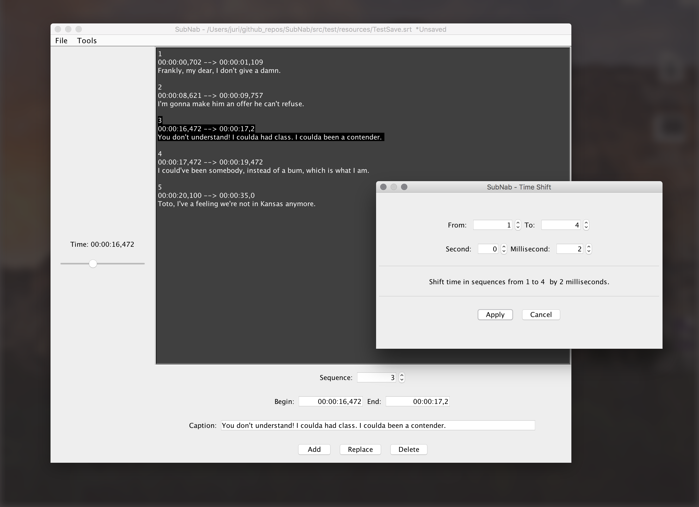

#SubNab 

> __A simple SRT subtitles editor.__

## Latest stable release
v0.1.1

##Features
* Create, open and edit .SRT files
* .SRT format validation
* Modify time of caption ranges using 'Time Shift' tool.

##Download
* Windows:
* Mac OS X:
* Universal:

##Screenshot

